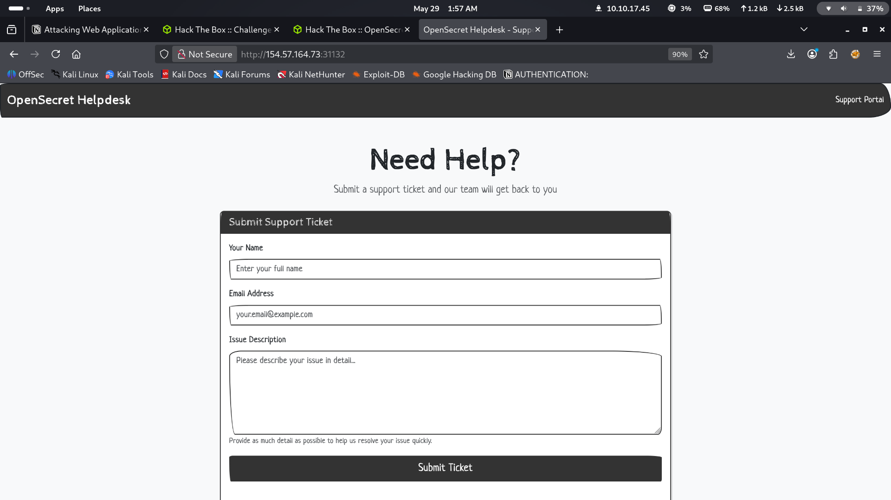
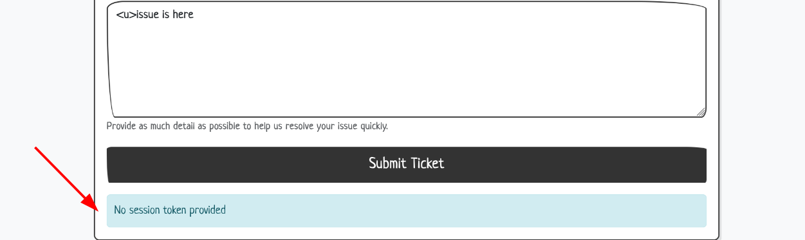
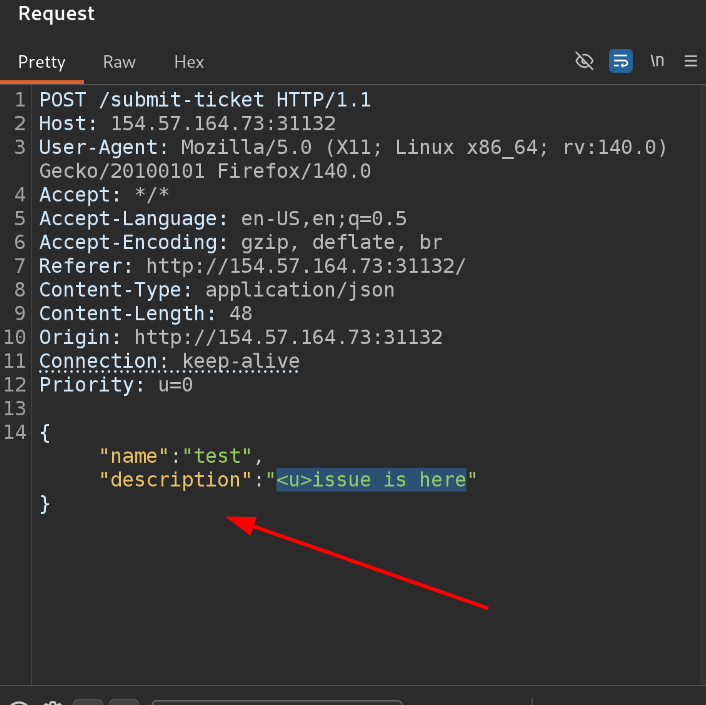
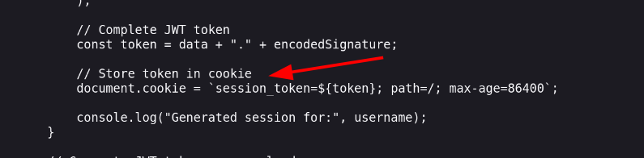
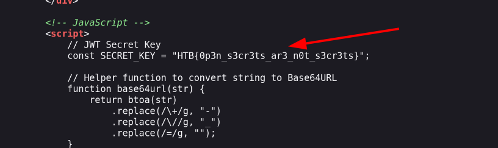
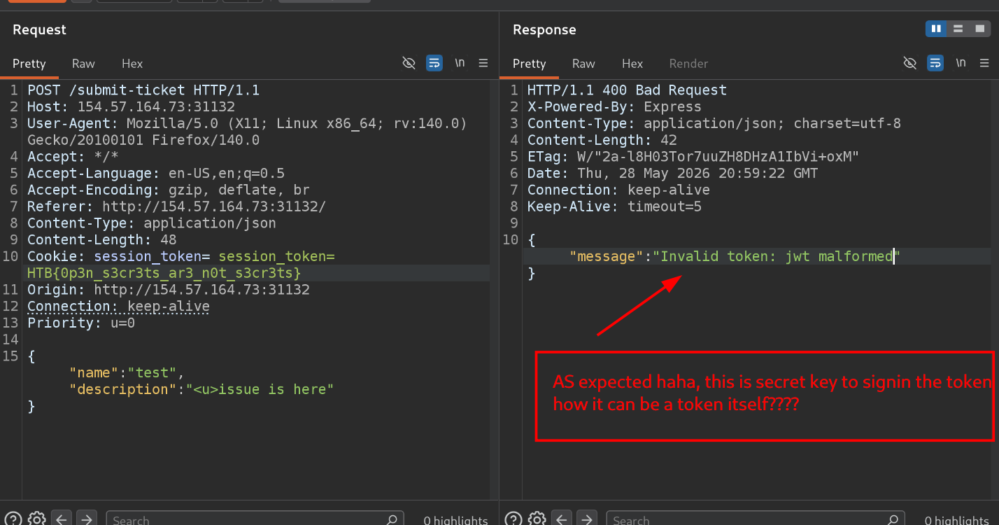
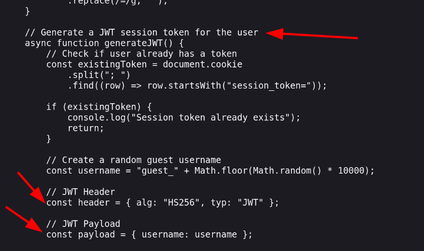
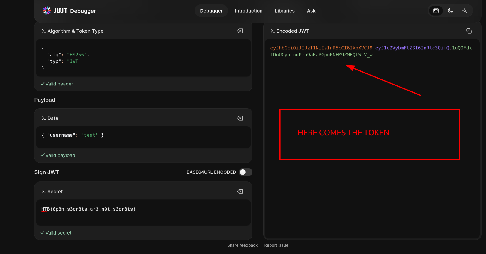
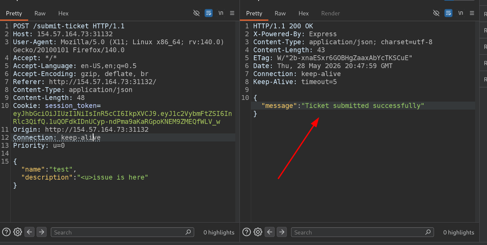

#  HackTheBox  OpenSecret
**Difficulty:** Very Easy
**Category:** Web / JWT

---

##  What This Challenge Is About

A fake help desk portal where users submit support tickets. The app uses **JWT (JSON Web Tokens)** for session management  but the implementation has a critical flaw. Our job: find it and exploit it.

**Core Vulnerability:** The JWT secret key is **hardcoded and exposed in the client-side source code**. Anyone who reads the page source can forge their own valid JWT token.

---

##  Recon  Walking Through the App

### Step 1  Opening the Website

First look at the portal. Simple ticket submission form. Nothing scary.



---

### Step 2  Submitting Without a Token

Tried submitting a ticket straight away. Got hit with:

> **"No session token provided"**



The app wants a session token before it will accept anything.

---

### Step 3  Testing the Form

Threw in a quick test submission:

```
name:        test
email:       abc@gmail.com
description: <u>issue is here
```

Noticed that only `name` and `description` show up in the **POST request body**  email is dropped. Good to know for later.



---

## Source Code Review  Finding the Cookie Name

Read the page source. Found that the app expects the session token to be passed as a **cookie** with the name:

```
session_token
```

So the format to pass it is:

```
Cookie: session_token=<TOKEN_HERE>
```



---

##  The Big Find  Secret Key in Source Code

Kept reading the source. Found something that should **never** be in client-side code:

> The **JWT signing secret** hardcoded right there in the JavaScript.



```
HTB{0p3n_s3cr3ts_ar3_n0t_s3cr3ts}
```

**First instinct:** Is this the flag itself? Tried passing it directly as the cookie value in Burp:

```
Cookie: session_token=HTB{0p3n_s3cr3ts_ar3_n0t_s3cr3ts}
```



Nope. The app rejected it. That's because a JWT needs to be **signed and properly formatted**  this is just the *signing secret*, not the token itself.

---

##  Understanding JWT Structure

A JWT token has **3 parts**, separated by dots:

```
HEADER.PAYLOAD.SIGNATURE
```

| Part | What it contains |
|------|-----------------|
| **Header** | Algorithm used (e.g. `HS256`) and token type |
| **Payload** | The actual data (e.g. `username`) |
| **Signature** | HMAC of header + payload, signed with the secret key |

Reading more of the source code confirmed exactly what the app uses:

```javascript
// JWT Header
const header = { alg: "HS256", typ: "JWT" };

// JWT Payload
const payload = { username: username };
```



So we need:
- **Algorithm:** `HS256`
- **Payload:** `{ "username": "anything" }`
- **Signature:** signed with the exposed secret key

---

##  Forging the JWT Token

Headed over to **[jwt.io](https://jwt.io)**  the go-to tool for building and decoding JWT tokens.

Filled in:

| Field | Value |
|-------|-------|
| Algorithm | `HS256` |
| Payload | `{ "username": "test" }` |
| Secret | `HTB{0p3n_s3cr3ts_ar3_n0t_s3cr3ts}` |

jwt.io generated a perfectly valid, signed JWT token.



---

##  Submitting the Forged Token  Flag Get

Took the generated token into **Burp Suite**, added it as the cookie:

```
Cookie: session_token=<FORGED_JWT_HERE>
```

Sent the request and...



> **Ticket submitted successfully.**

---

## Vulnerability Breakdown

| Item | Detail |
|------|--------|
| **Vulnerability** | Hardcoded JWT secret in client-side JavaScript |
| **CVSS Category** | Security Misconfiguration / Sensitive Data Exposure |
| **Impact** | Any user can forge a valid session token and impersonate any user |
| **Root Cause** | Secret key was included in frontend code (visible to everyone) |

---

##  How This Should Have Been Fixed

1. **Never put secrets in frontend code.** The signing key must live server-side only  environment variables, a secrets manager, anything but the browser.
2. **Validate tokens server-side strictly.** Even if a key leaks, additional claims (expiry, IP binding, etc.) add friction.
3. **Rotate keys immediately** if they are ever exposed.

---

##  Full Attack Chain Summary

```
Read page source
    → Found hardcoded JWT secret key
    → Understood JWT structure from source (HS256, username payload)
    → Forged a valid JWT at jwt.io using the leaked secret
    → Passed the token as a Cookie in Burp Suite
    → App accepted it → Flag captured
```

---

##  Final Thoughts

The challenge name **OpenSecret** says it all  a secret that's been left in the open isn't a secret anymore. This is a real-world mistake that shows up in actual bug bounty programs more often than you'd think. Developers sometimes forget that *anything shipped to the browser is public*.

**Key takeaway:** Client-side code is readable by everyone. **Secrets never belong there.**

---

